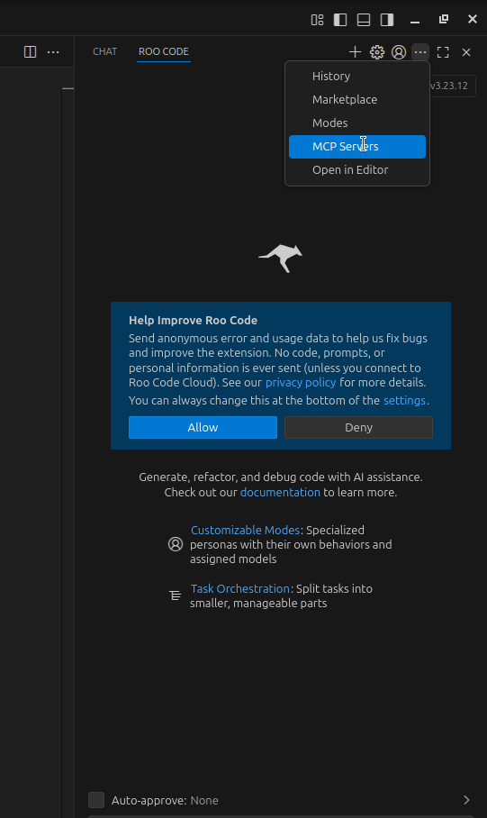

# obsidian-ai-client-collab-setup

Let's do a quick walk through the process of setting up a continuous learning environment with an LLM client of
your choice and using Obsidian a note-taking platform. This guide will include the following steps:

1. Setting up Obsidian.
2. Setting up an LLM client. Here w will use Roo Code as an example, but you can use any LLM client you prefer.

These instructions will be as short as possible and focus on the steps where we have additions to the existing obsidian
setup or where we do things differently.

## Setting up Obsidian

1. Installation and installing the necessary plugins
2. Setting up obsidian sync
3. The collaborative learning template

### Installing Obsidian and Plugins

Follow the instructions from https://obsidian.md/ to install Obsidian on your computer and set up your personal vault.
After that you will need to install / enable 3 plugins: Daily Notes, Obsidian Rest API and Tasks.

### Daily Notes

Daily notes is a plugin that allows you to automatically create notes on a daily basis. We will configure this to:

1. Gather all our _currently important_ TODO tasks in a single place.
2. Split these TODO tasks into sections. Now we'll just split them into review tasks and other.

Daily notes is a core plugin, so the only thing we need to do is first enable this in the settings.


Then we need to configure a template for the daily notes to use. Copy the `resoucers/daily_note_template.md`  to the
location of your choice in obsidian and then edit the template location in the Daily Notes settings.


### Obsidian Tasks

The Obsidian Tasks pluging is a community maintained plugin that allows you to create tasks and track them. Search for
the plugin "Tasks" in the Obsidian Marketplace, install it and enable it. If I remember correctly, it does not require
any additional steps to set up.

### Obsidian Rest API

The Obsidian Rest API plugin is a community maintained plugin that allows you to connect to an Obsidian server using
REST. This is required for the Obsidian MCP server to work. Search for the plugin "Local REST API" in the Obsidian
Marketplace, install
it and enable it. Then grab the API key from the plugin settings so we can use it later.

## Setting up the LLM client (Roo Code)

UPDATE 29.1.2026: If you don't want to use VS Code, there's now a plugin that for the Intellij family of IDEs 
called Kilo Code. It is a fork of Roo Code and the setup is _exactly_ the same. 

To integrate an LLM client with Obsidian, we will need to pick a client first. I came up with this workflow
while using Roo Code, so I'll show you how to set it up with Roo Code. If you want to use another LLM client that is
less
coding-oriented, feel free to do that. You just need a client where you can automatically edit your prompts before
passing them to the LLM.

1. Installation
2. Configuring the Obsidian MCP server
3. Injecting the collaborative learning prompt.

### VS Code and Roo Code

Roo Code is a VS Code extension that allows you to use LLM to generate code. I personally prefer using Jetbrains
products, but unfortunately Roo Code does not support Jetbrains yet. Follow the instructions from the official VS
Code site to install it and then install the Roo Code extension using the
instructions [here](https://marketplace.visualstudio.com/items?itemName=RooVeterinaryInc.roo-cline). Then follow the
instructions to pick an LLM or use an API key with Openrouter.ai to be able to try different models.

### Configuring the Obsidian MCP server

Step 1: Install uv on your system. Instructions can be found [here](https://docs.astral.sh/uv/getting-started/installation/)

#### Out of the box

Find the section on MCP servers in Roo code


and add this segment of code to the list of MCP servers.

```json
{
  "mcp-obsidian": {
    "command": "uvx",
    "args": [
      "mcp-obsidian"
    ],
    "env": {
      "OBSIDIAN_API_KEY": "<your_api_key_here>",
        "OBSIDIAN_HOST": "127.0.0.1",
        "OBSIDIAN_PORT": "27124"
    }
  }
}
```

This will automatically download the latest version of the codebase and run it when the server is MCP server is called.
However, if you want to have more control on the MCP server code because, for example, at the time of writing there was
a bug that
was easily fixable but the fix had not made it to the codebase, you can do the following:

1. Clone [this repo](https://github.com/MarkusPfundstein/mcp-obsidian)
2. Again find the section on MCP servers in Roo code and add this segment of code to the list of MCP servers. Here we do
   not want to install the code from PYPI but we want to point it to our local directory.

```json
{
  "mcpServers": {
    "mcp-obsidian": {
      "command": "uv",
      "args": [
        "--directory",
        "<path to cloned repo>",
        "run",
        "mcp-obsidian"
      ],
      "env": {
        "OBSIDIAN_API_KEY": "<your_api_key_here>",
        "OBSIDIAN_HOST": "127.0.0.1",
        "OBSIDIAN_PORT": "27124"
      }
    }
  }
}
```

Finally we need add our custom prompt to be included in all modes. 

Open the Roo Code settings --> Agent Behaviour and find the section called `Custom Intstructions for All Modes`. 
Paste the file `ai_agent_prompt.md` into that field, edit the custom template location and that's it! 

Now the LLM client should include your instructions whenever you query it!
(_Keep in mind: LLMs are non-deterministic. So sometimes it will just NOT act according to the prompt! 
But it should take it into account most of the time!)


