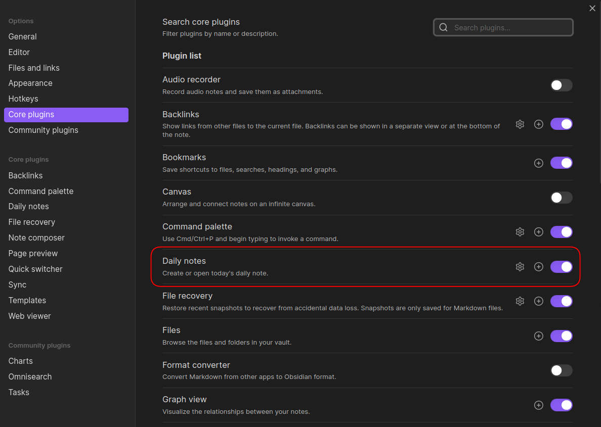
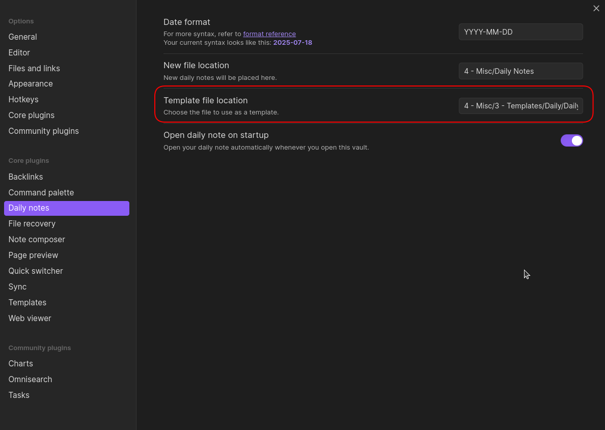

# obsidian-ai-client-collab-setup

Let's do a quick walk through the process of setting up a continuous learning environment with an AI client of
your choice and using Obsidian a note-taking platform. This guide will include the following steps:

1. Setting up Obsidian.
2. Setting up an AI client. Here w will use Roo Code as an example, but you can use any AI client you prefer.

These instructions will be as short as possible and focus on the steps where we have additions to the existing obsidian
setup or where we do things differently.

## Setting up Obsidian

1. Installation and installing the necessary plugins
2. Setting up obsidian sync
3. The collaborative learning template

### Installing Obsidian and Plugins

Follow the instructions from https://obsidian.md/ to install Obsidian on your computer and set up your personal vault.
After that you will need to install / enable 3 plugins: Daily Notes, Obsidian Rest API and Tasks.

### Daily Notes

Daily notes is a plugin that allows you to automatically create notes on a daily basis. We will configure this to:

1. Gather all our _currently important_ TODO tasks in a single place.
2. Split these TODO tasks into sections. Now we'll just split them into review tasks and other.

Daily notes is a core plugin, so the only thing we need to do is first enable this in the settings.

Then we need to configure a template for the daily notes to use. Copy the `resoucers/daily_note_template.md`  to the
location of your choice in obsidian and then edit the template location in the Daily Notes settings.

## Setting up the AI client (Roo Code)

1. Installation
2. Configuring the Obsidian MCP server
3. Injecting the collaborative learning prompt.

